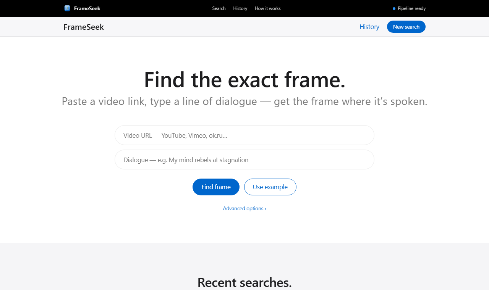

<div align="center">


# FrameSeek

### CPU-Optimized Speech-to-Frame Localization Pipeline

**Paste a video URL, type a line of dialogue, and get the exact frame where it is spoken.**


</div>

---

## Table of contents

- [Overview](#overview)
- [Features](#features)
- [How it works](#how-it-works)
- [Architecture](#architecture)
- [Results](#results)
- [Getting started](#getting-started)
- [Usage](#usage)
- [REST API](#rest-api)
- [Project structure](#project-structure)
- [Testing](#testing)
- [Troubleshooting](#troubleshooting)
- [Documentation](#documentation)
- [Tech stack](#tech-stack)
- [License](#license)

---

## Overview

FrameSeek locates the **exact video frame** at which a line of dialogue is spoken. Given
any video URL supported by yt-dlp (YouTube, Vimeo, ok.ru and many more) and a quote, it
returns the frame image, the timestamp, the frame number, a similarity score and the text
that was actually heard.

It is designed to run **locally on a CPU-only laptop**. A speech-aware, coarse-to-fine
transcription strategy lets the smallest Whisper model (`tiny.en`) land within
**2 frames (0.08 s)** of a GPU `large-v3` baseline on a 54-minute video, in **5.4 minutes**.
The pipeline escalates to larger models and wider searches only when a first pass misses,
so it also handles songs, dialogue over loud soundtracks and non-English audio.

The project consists of two applications that run side by side on the same machine:

- **`backend/`** — a FastAPI REST API and the `frame_finder` ML pipeline
- **`frontend/`** — a React web application (JavaScript, Vite)

<p align="center">
  
</p>

## Features

- **Frame-accurate localization** — word-level timestamps from faster-whisper, converted
  to a frame number and extracted with OpenCV.
- **CPU-optimized** — Silero VAD measures speech first; long videos get a fast coarse pass
  to locate a ±45 s window, then a precise fine pass on that window only.
- **Word-level matching** — an exact run of words first, then a rapidfuzz sliding window
  over the whole transcript. Contractions and punctuation are normalised, so *"I am"*
  matches *"I'm"*, and lines that span two transcript segments are still found.
- **Robust to music, singing and other languages** — speech detection is advisory, missed
  lines trigger a full-audio retry, near misses are confirmed by a larger model, and
  non-English audio switches to multilingual Whisper automatically.
- **Live progress** — a stage-by-stage tracker and the pipeline log, streamed to the
  browser while the job runs.
- **Verifiable results** — the matched frame, timestamp, frame number and score, the text
  typed versus the text heard, and the video playing from the matched moment.
- **Persistent history** — every search is stored on disk and survives restarts.
- **Self-diagnosing** — `/api/health` reports exactly which dependency (ffmpeg, a Python
  package) is missing, and the UI displays it.
- **Command-line interface** — `python -m frame_finder` runs the same pipeline from a terminal.

## How it works

```
Video URL
    │
    ▼
yt-dlp (H.264 ≤ 1080p) ─────► MP4                (curl --tls-max 1.2 fallback)
    │
    ▼
ffprobe ────────────────────► FPS · duration · VFR flag
    │
    ▼
ffmpeg ─────────────────────► mono 16 kHz WAV
    │
    ▼
Silero VAD ─────────────────► speech segments · speech coverage (advisory)
    │
    ▼
Language detection ─────────► English → .en models · other → multilingual models
    │
    ▼
Tier classifier ────────────► short (< 3 min speech) · medium (< 20 min) · long
    │                          │
    │  short / medium:         └─ long: coarse pass over the full audio
    │  one transcription pass       → ±45 s candidate window
    │                               → fine pass on the window only
    ▼
Matcher (exact word run → rapidfuzz sliding window)
    │   miss → full-audio retry → verify near misses with base.en (±45 s)
    ▼
OpenCV frame seek ──────────► matched_frame.jpg + result.json
```

The coarse pass only has to *locate* the right window; the fine pass re-transcribes
90 seconds of audio for word-level precision. This delivers large-model accuracy at
small-model cost.

### Robustness strategy

Silero VAD is tuned for clean speech. In a song or over a loud soundtrack it can report
almost no speech, so FrameSeek treats it as advice rather than a gate and escalates
**only when a pass misses**:

| Situation | Action |
|-----------|--------|
| VAD speech covers less than 10 % of the video | Transcribe the full audio instead of the VAD segments |
| The speech-only pass misses the line | Retry on the full audio without VAD |
| A candidate scores 65–79 (near miss) | Re-transcribe ±45 s around up to three candidates with `base.en` |
| The audio is not English | Language is auto-detected; `.en` models switch to multilingual (`tiny.en` → `tiny`) |
| English query on non-English audio | The result explains which language was heard |

Clean speech costs the same as before. Every result lists the passes that ran
(`tier_info.passes`), so the path to each answer is transparent. See
[`docs/cli.md`](docs/cli.md#robustness-music-singing-and-other-languages) for details.

## Architecture

```
┌────────────────────────────┐  /api (Vite proxy)  ┌──────────────────────────────┐
│ React + JavaScript (Vite)  │ ──────────────────► │ FastAPI                      │
│ • search form              │   JSON, polling     │ • REST endpoints             │
│ • live progress            │ ◄────────────────── │ • FIFO queue, 1 worker thread│
│ • frame + video viewer     │                     │ • per-job folder on disk     │
│ • history                  │                     │ • stdout → per-job log       │
└────────────────────────────┘                     └──────────────┬───────────────┘
                                                                  │ run_pipeline(on_stage=…)
                                                                  ▼
                                                    frame_finder (ML pipeline)
```

| Decision | Rationale |
|----------|-----------|
| **One worker thread and a FIFO queue** | The pipeline keeps its settings in module-level globals, so jobs must never run concurrently in one process. A single worker guarantees this and keeps Whisper and VAD models loaded between jobs. |
| **`on_stage` callback** | Provides live progress without changing the algorithm; `run_pipeline` reports each stage as it starts. |
| **Per-thread stdout capture** | The pipeline reports progress with `print()`; a thread-routed stdout proxy turns the worker's output into that job's log. |
| **Lazy heavy imports** | PyTorch and faster-whisper load on the first job, so the API starts instantly and can report missing dependencies instead of failing to boot. |
| **Jobs stored on disk** | `backend/data/jobs/<id>/` holds `job.json`, `logs.txt`, `result.json`, the frame and the video. Jobs interrupted by a restart are marked as failed. |
| **H.264 ≤ 1080p downloads** | 4K and 8K AV1 streams are many times larger and slower to decode without making the extracted frame more useful. |

## Results

All measurements were taken on an **Intel Core i5-1245U laptop, CPU only** (8 threads).

### Real-world validation

Two videos submitted through the web application, before and after the robustness
update. The "after" column shows the actual results returned by the app.

| Video | Content | Query | Before | After |
|-------|---------|-------|--------|-------|
| *The Avengers* (2012), Chitauri invasion clip — 5 min | English film dialogue over an orchestral score | "I'm always angry" | Close match, score 82.4 | **Exact match, score 100** — 01:00.320, frame 1446, in 73 s |
| Ellie Goulding, *Love Me Like You Do* (lyrics video) — 5 min | English song; VAD detected only 6 s of speech in 315 s | "Cause I'm not thinking straight" | Not found (score 28) — the lyric was never transcribed | **Close match, score 80** — 01:45.860 (first chorus), frame 2541, in 115 s |

How each result was reached, taken from `tier_info.passes`:

| Video | Passes |
|-------|--------|
| *The Avengers* | speech only · `tiny.en` |
| *Love Me Like You Do* | full audio · `tiny.en` → verify ±45 s · `base.en` |

Additional checks, run directly against the pipeline on the same laptop:

| Video | Query | Result |
|-------|-------|--------|
| *Love Me Like You Do* | "love me like you do" | Exact match at 01:01.080 in 66 s |
| *Love Me Like You Do* | "Cause I'm not thinking straight" | Exact match at 02:56.800 (second chorus) in a separate run, via verification of the next candidate |
| *The Avengers* | "the eagle has landed at midnight" (absent) | Correctly not found; no false match |

### Long-video benchmark

54.4-minute episode, query *"My mind rebels at stagnation"*, measured before the
robustness update:

| Configuration | Runtime | Result |
|---|---|---|
| Original (`small`, beam 5) | est. 45–70 min | — |
| `base.en` variant | 15.8–20.9 min | fuzzy score 61.2, frame at 326.15 s |
| **FrameSeek (`tiny.en`, coarse-to-fine)** | **5.4 min** | **score 78.9, frame 7787 at 324.77 s** |
| Ground truth (GPU `large-v3`) | — | frame 7785 at 324.68 s (difference: 2 frames) |

### Download optimisation

End-to-end testing revealed that yt-dlp was fetching an **8K AV1** stream (1.39 GB) for a
5-minute clip. Restricting downloads to H.264 at up to 1080p reduced it to 132 MB and the
total run time from 180 s to 103 s, with an identical matched frame.

## Getting started

### Prerequisites

| Tool | Version | Installation |
|------|---------|--------------|
| Python | 3.10+ | <https://www.python.org/downloads/> |
| Node.js | 18+ | <https://nodejs.org/> |
| ffmpeg and ffprobe | any recent | Windows: `winget install Gyan.FFmpeg` · macOS: `brew install ffmpeg` · Ubuntu: `sudo apt install ffmpeg` |

Open a **new terminal** after installing ffmpeg so that it is on `PATH`
(verify with `ffprobe -version`).

### Installation

```bash
git clone <your-repo-url> FrameSeek
cd FrameSeek

# Python environment (backend and ML pipeline)
python -m venv .venv
.venv\Scripts\activate              # Windows — macOS/Linux: source .venv/bin/activate
pip install -r backend/requirements.txt

# Frontend
cd frontend
npm install
```

### Running the application

```bash
# Terminal 1 — backend at http://localhost:8000 (Swagger UI at /docs)
cd backend
uvicorn app.main:app --port 8000

# Terminal 2 — frontend at http://localhost:5173
cd frontend
npm run dev
```

Open **<http://localhost:5173>**. The first search downloads the Whisper models
(`tiny.en`, the multilingual `tiny` used for language detection, and `base.en` when a near
miss needs verification) and Silero VAD. They are cached and reused afterwards.

## Usage

### Web application

1. Paste a video URL and type the dialogue line, or select **Use example**.
2. Select **Find frame**. The progress tracker follows each pipeline stage.
3. Review the frame, timestamp, score and heard text. Use **Jump to** to play the video
   from the match, or **Download result.json** to save the full result.
4. Reopen earlier searches from **Recent searches**.

**Advanced options** expose the pipeline settings: the Whisper model for each tier, the
verification model, the spoken language (auto-detected by default), the match and coarse
thresholds, the verification window, CPU threads and browser cookies for login-gated videos.

For non-English videos, type the dialogue in the language and script in which it is spoken.

### Command line

```bash
cd backend
python -m frame_finder \
    --source "https://youtu.be/atOgj_ZaO7M" \
    --query  "I'm always angry" \
    --outdir ./output
```

All flags are documented in [`docs/cli.md`](docs/cli.md#cli-flags).

### Result format

Actual result for the *Avengers* search above:

```json
{
  "status": "success",
  "query": "I'm always angry",
  "matched_text": "I'm always angry.",
  "similarity_score": 100.0,
  "timestamp_sec": 60.32,
  "frame_number": 1446,
  "video_metadata": { "fps": 23.976, "duration_sec": 319.07, "is_vfr": false },
  "language": { "code": "en", "name": "English", "probability": 0.986 },
  "tier_info": {
    "tier": "short",
    "model_size": "tiny.en",
    "total_speech_sec": 63.34,
    "speech_coverage": 0.199,
    "passes": ["speech only · tiny.en"]
  },
  "timings": {
    "acquire_video": 9.74, "run_vad": 12.08, "detect_language": 3.86,
    "transcribe": 45.72, "extract_frame": 0.49, "total": 72.93
  }
}
```

| `status` | Meaning |
|----------|---------|
| `success` | Exact match (score 100) |
| `partial_match` | Fuzzy match at or above the match threshold (default 80); `note` explains any verification |
| `no_match` | Not found; `closest_text`, `similarity_score` and `reason` are included |
| `download_failed`, `metadata_failed`, `no_audio_track`, `audio_extraction_failed`, `transcription_failed`, `frame_extraction_failed` | A pipeline stage failed; `reason` describes why |

## REST API

| Method | Endpoint | Description |
|--------|----------|-------------|
| `GET` | `/api/health` | Dependency report (ffmpeg, ffprobe, Python packages) |
| `POST` | `/api/jobs` | Create a job: `{ "source_url", "query", "options" }` |
| `GET` | `/api/jobs` | Search history, newest first |
| `GET` | `/api/jobs/{id}` | Status, current stage, stage history and result |
| `GET` | `/api/jobs/{id}/logs?offset=N` | Incremental pipeline log |
| `GET` | `/api/jobs/{id}/frame` | Matched frame (JPEG) |
| `GET` | `/api/jobs/{id}/video` | Downloaded video (supports HTTP range requests for seeking) |
| `DELETE` | `/api/jobs/{id}` | Delete a finished or queued job and its files |

Interactive documentation: <http://localhost:8000/docs>

```bash
curl -X POST http://localhost:8000/api/jobs \
     -H "Content-Type: application/json" \
     -d '{"source_url": "https://youtu.be/atOgj_ZaO7M", "query": "I am always angry"}'
```

Optional `options` fields: `model`, `coarse_model`, `fine_model`, `verify_model`,
`language`, `match_threshold`, `coarse_threshold`, `window_buffer`, `cpu_threads`,
`cookies_from_browser`.

## Project structure

```
FrameSeek/
├── backend/
│   ├── app/                        # FastAPI application
│   │   ├── main.py                 #   application factory, CORS, worker lifecycle
│   │   ├── settings.py             #   environment-driven settings
│   │   ├── schemas.py              #   Pydantic request and response models
│   │   ├── api/                    #   routers: health, jobs
│   │   └── services/               #   job store, worker, pipeline adapter,
│   │                               #   stdout capture, dependency checks
│   ├── frame_finder/               # ML pipeline (also a CLI)
│   │   ├── download.py             #   yt-dlp / curl acquisition
│   │   ├── metadata.py             #   ffprobe and OpenCV metadata
│   │   ├── audio.py                #   ffmpeg audio extraction, WAV sampling
│   │   ├── vad.py                  #   Silero VAD and tier classifier
│   │   ├── transcribe.py           #   language detection, faster-whisper
│   │   ├── matching.py             #   word-level exact and fuzzy matcher
│   │   ├── frame.py                #   OpenCV frame export
│   │   ├── pipeline.py             #   orchestrator and fallback strategy
│   │   └── main.py  config.py  timing.py
│   ├── tests/                      # api/ · services/ · pipeline/
│   ├── requirements.txt
│   └── pytest.ini
├── frontend/
│   ├── public/frameseek.svg        # application icon
│   ├── src/
│   │   ├── api/                    # REST client
│   │   ├── components/             # layout/ search/ job/ history/ common/ sections/
│   │   ├── hooks/                  # useJob, useJobs, useHealth
│   │   ├── lib/                    # stage mapping, formatters
│   │   ├── styles/                 # design tokens and styles
│   │   ├── test/                   # test setup, in-memory fake backend
│   │   └── App.jsx  main.jsx  config.js
│   ├── index.html
│   ├── vite.config.js
│   └── package.json
├── docs/
│   ├── assets/                     # avatar, screenshot
│   ├── approach.md                 # engineering journey
│   ├── cli.md                      # pipeline internals and CLI reference
│   ├── design-system.md            # UI design system
│   └── prompts.txt                 # prompts used during development
├── LICENSE
└── README.md
```

## Testing

```bash
cd backend  && python -m pytest          # 139 tests — pipeline, services, API
cd frontend && npm test                  #  96 tests — UI
cd frontend && npm run test:coverage     # UI coverage report
```

| Layer | Tooling | Coverage |
|-------|---------|----------|
| Pipeline | pytest | Word-level matching (contractions, cross-segment lines, non-Latin scripts, candidates), tiering, language detection and model selection, transcription arguments, download validation and format selection, frame extraction on a synthetic video, orchestration and every fallback path (ML stages faked) |
| Services | pytest | Job persistence and restart recovery, log offsets, per-thread stdout capture, pipeline adapter |
| API | pytest, FastAPI `TestClient` | Every endpoint, input validation, queue ordering, job lifecycle, deletion, HTTP range requests, CORS |
| Frontend | Vitest, React Testing Library | API client, polling hooks, form validation, progress, results, history, navigation, and the full application flow against a fake backend |
| End to end | Real servers, real URLs, CPU only | The videos listed under [Real-world validation](#real-world-validation) |

## Troubleshooting

| Symptom | Resolution |
|---------|------------|
| The UI reports *Backend not reachable* | Start the backend: `cd backend && uvicorn app.main:app --port 8000` |
| The UI reports missing pipeline dependencies | Install what the notice lists (usually ffmpeg), then open a new terminal |
| `download_failed` with `HTTP Error 403` | YouTube occasionally refuses a request. Retry; if it persists, update yt-dlp with `pip install -U yt-dlp` |
| `download_failed` with a connection reset | The site is blocked on the current network (for example ok.ru on some networks); the TLS connection is reset before any download starts |
| `no_match` on a non-English video | Type the dialogue in the spoken language and script; the result names the detected language |
| The first search is slow | Models are downloaded once and cached |
| `WinError 1314` during the first model download | Delete `~/.cache/huggingface/hub/models--Systran--faster-whisper-<model>` and retry, or enable Windows Developer Mode |

## Documentation

| Document | Contents |
|----------|----------|
| [`docs/approach.md`](docs/approach.md) | Engineering journey: Kaggle notebook, CLI, CPU optimisation, web application, robustness |
| [`docs/cli.md`](docs/cli.md) | Pipeline modules, robustness strategy, CLI flags, output format, benchmarks |
| [`docs/design-system.md`](docs/design-system.md) | Colours, typography and components used by the UI |
| [`backend/README.md`](backend/README.md) | Backend layout and configuration |
| [`frontend/README.md`](frontend/README.md) | Frontend layout and scripts |

## Tech stack

| Area | Technologies |
|------|--------------|
| Speech and vision | faster-whisper (CTranslate2), Silero VAD (PyTorch), rapidfuzz, OpenCV, ffmpeg, yt-dlp |
| Backend | Python, FastAPI, Pydantic v2, Uvicorn |
| Frontend | React 19, JavaScript (ES2022), Vite |
| Testing | pytest, FastAPI TestClient, Vitest, React Testing Library |

## License

FrameSeek is released under the [MIT License](LICENSE).
